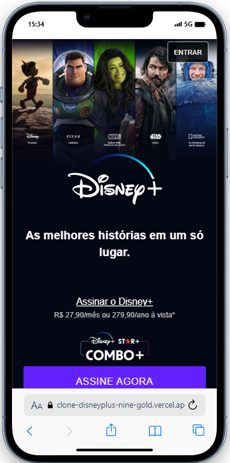
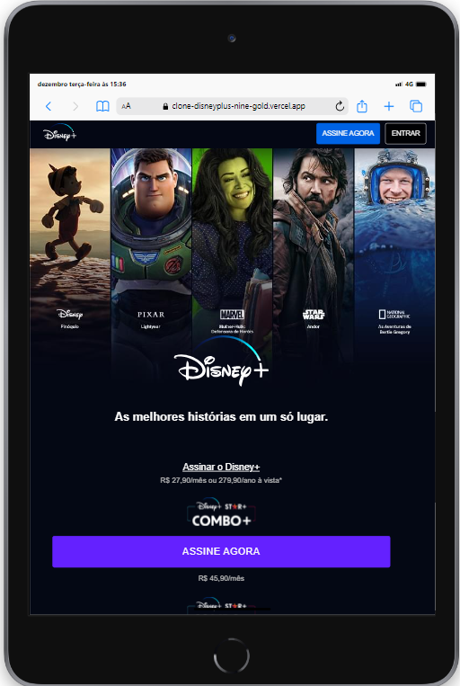

    

<h1 align="center">Clone da tela de informações da página inicial da Disney</h1>

Página criada com o objetivo de aplicar e aprimorar conhecimentos adquiridos com estudos 
aprofundados em HTML5, CSS, JAVASCRIPT, SASS e GULP.

<h3 align="center" style="color:red;">Considerando a responsividade como parte vital</h3>

    
    

